# tiptap_golang

## Tabel Item
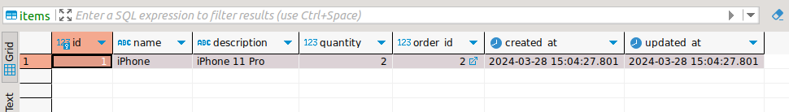

## Tabel Order
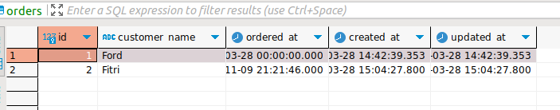

## Create Order
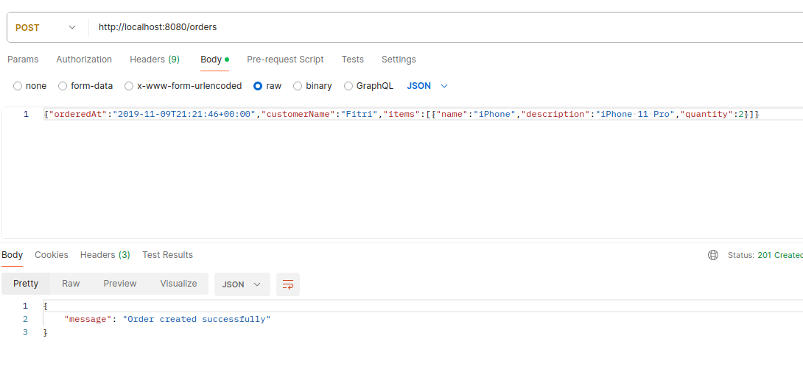

## Get All Orders
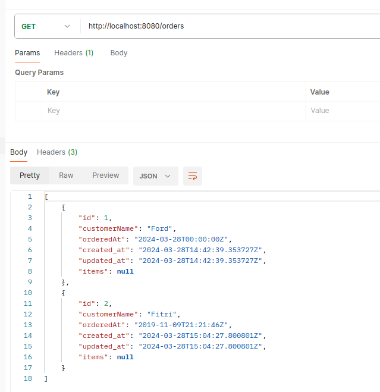

## Get Order by ID - Success
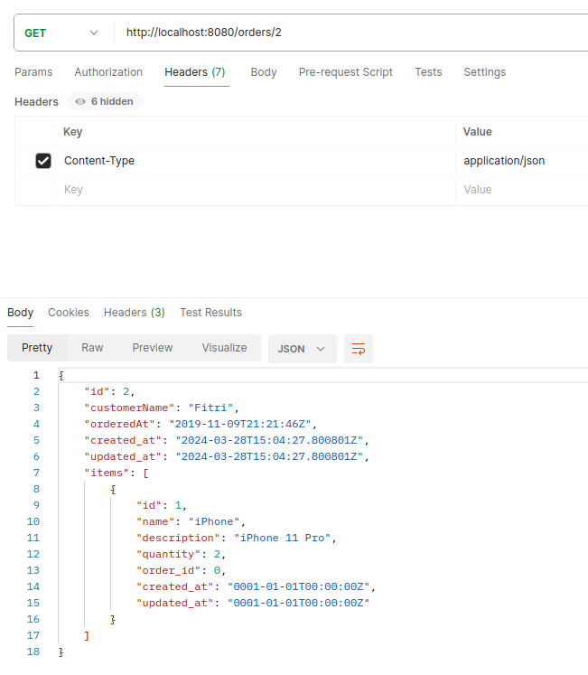

## Get Order by ID - Failed
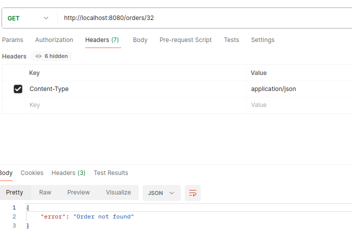

## Update by ID - Success
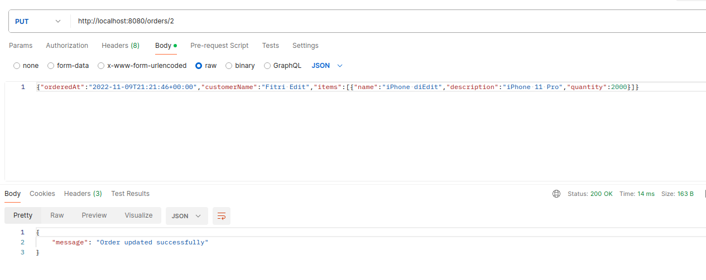

## After Update by ID
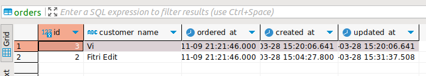

## Delete by ID - Success
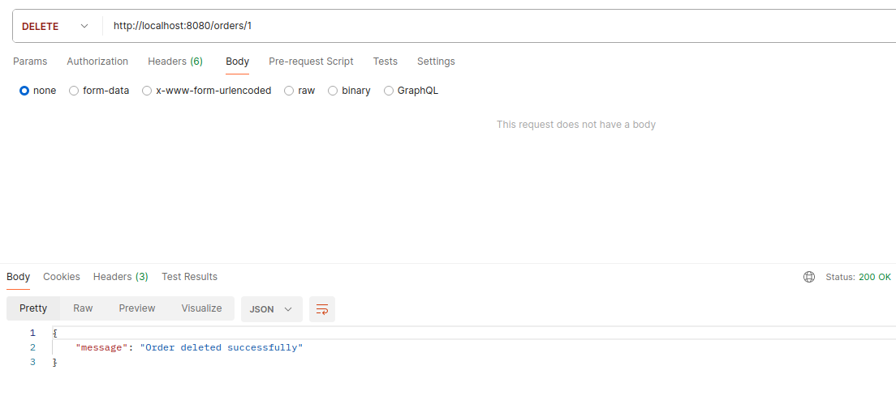

## Delete by ID - Failed
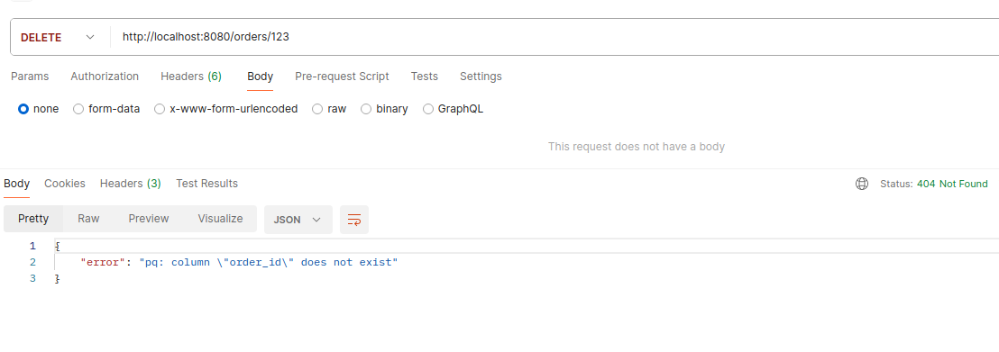

## After Delete
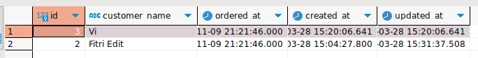
