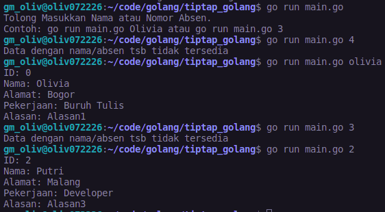

# tiptap_golang

Buatlah sebuah service berupa CLI untuk menampilkan data teman-teman kalian di kelas.

Contohnya, ketika kalian menjalankan perintah “go run main.go Fitri” maka data yang akan muncul adalah data teman kalian dengan nama "Fitri". Data yang harus ditampilkan yaitu: 
Nama
Alamat
Pekerjaan
Alasan memilih kelas Golang

Gunakanlah struct dan function untuk menampilkan data tersebut. Kalian bisa menggunakan os.Args untuk mendapatkan argument pada terminal.

Flow teknis coding :
Buat logic untuk menampilkan/generate data peserta dari cli by name, contoh cli : go run main.go Fitri
Buatlah looping yang memproses slice of string dari beberapa nama peserta, dimana jika nama yg di ketik pada cli sama dengan yang ada di data peserta maka akan dapat index dari data pesertanya dan di append pada data baru untuk ditampilkan pada CLI atau terminal.
Jika data nama atau absen yang diinput pada CLI tidak tersedia pada program, misal go run main.go Fitri atau go run main.go 1 maka bisa dihandle dengan pesan "Data dengan nama/absen tsb tidak tersedia".

